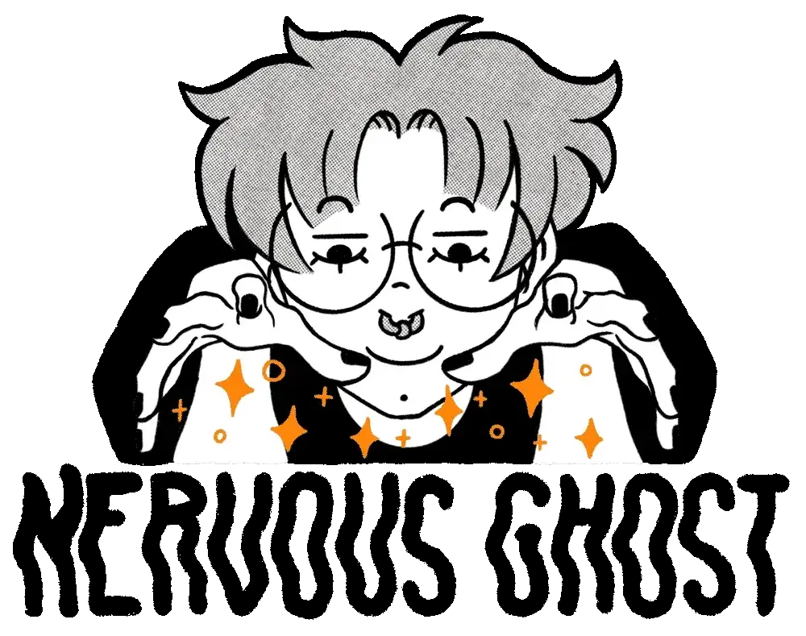

---
eleventyNavigation:
  key: About
  order: 3
---
# About

Hey there! My name is Brodie, I am a queer, non-binary and neurodivergent artist operating in Naarm (Melbourne). I love all things creative! I would consider myself a jack of all trades and a master of some! I am particularly drawn to things that are cute and colourful but have a spooky, dark or sometimes comical twist – something you will see as a common theme within my art! Art has been something I have been working on since I was very young and expanding more seriously through my adolescence. As I discovered more about myself, my art really began to reflect the hard work and effort I had put into growing as a person and improving my skills.

## More about this artist

I pride myself in creating pieces with inclusivity in mind. My art is a reflection of things that I take interest in and are deserving of more visibility and representation. I illustrate with the intention for people to take something meaningful, colourful and fun home with them and gain a sense of feeling treated!

## Process

I love to explore with all types of mediums and media! You will never see my sticking to one form of style for long. Because of this I find myself shifting my interests and products frequently. I love to diversify my art and products and I feel that is one of the big draws people have to my work.I tend to fill my notes app with ideas when I have them or messily thumbnail sketch my idea(s) down onto the nearest paper surface – this is the birthplace to a lot of the products you see today. I won’t lie though, my ADHD does have a tendency to put me into a spontaneous state of one and done projects that have had hours of nonstop time put into them, my Forbidden Cats print is a classic example of this.My stickers are all handmade in house! I design everything on Procreate, print each design out on sticker paper with my Epson printer, Laminate my stickers and then cut them out on my Cricut Machine :)